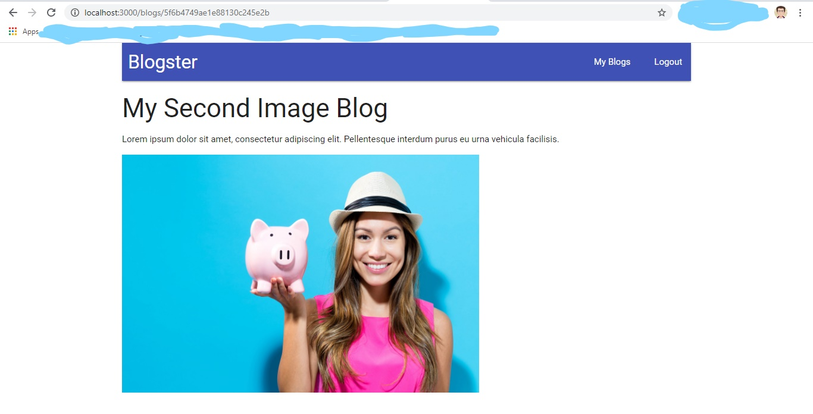

# Blogster

An Advance Node APP featuring these

- clustering
- worker threads
- Node C++ internals
- Automated Headless browser testing
- Travis CI
- Scalable File upload etc.



## commands

```
npm install
cd clients
npm install
cd ..
npm run dev
```

Note: Please don't forget to change your own credentials in the config.

Author: Anurag Shrivastava
